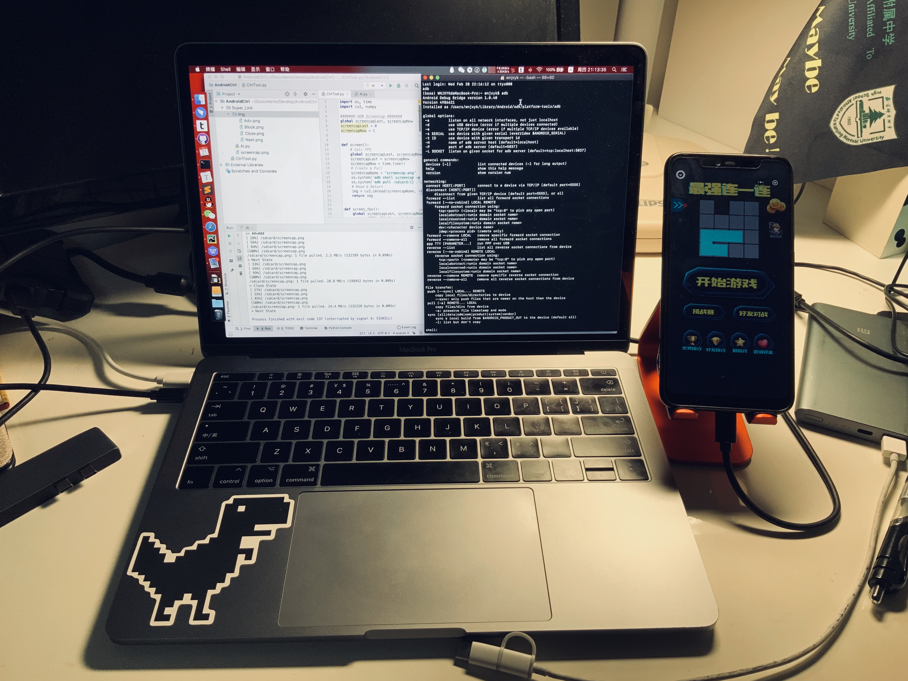
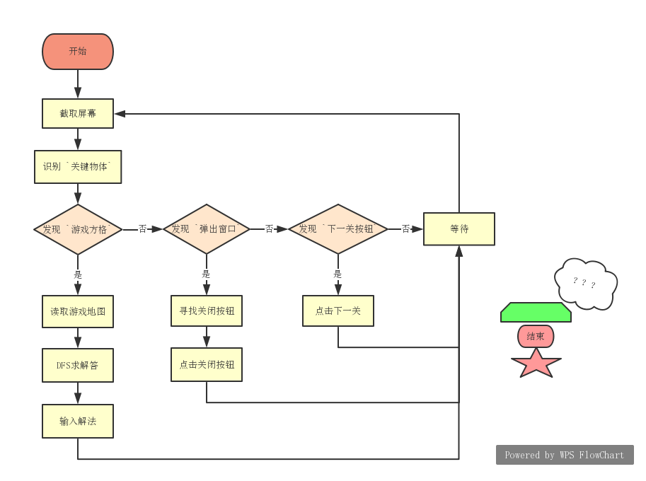

# Python 自动玩《最强连一连》

### 0x00. 前期准备

除了一台能运行的电脑，你还需要以下三样东西：

1. 安装好Py与依赖的 Pycharm（Python3 + opencv & numpy）
2. 配置好环境变量的 ADB
3. 能开机的 Android 手机



### 0x01. 实现思路

使用 ADB 与 OpenCV ，分别完成控制手机与生成解法两个任务，基本步骤如下：

1. 使用 ADB 命令截屏并传回本地

   ```shell
   adb shell screencap -p /sdcard/{ImgName}
   adb pull /sdcard/{ImgName} .
   ```

2. 使用 OpenCV 识别目标定位关键点

   ```python
   res = cv2.matchTemplate(image, template, method, result, mask) # 匹配模式图片
   min_val, max_val, min_loc, max_loc = cv2.minMaxLoc(res) # 寻找最匹配位置
   ```

3. 通过定点拾色，读取游戏地图

4. 使用 DFS，搜索解法

5. 通过 ADB 点击命令，输入解答

   ```shell
   adb shell input tap x y
   ```


为了能够达到无人监守自动游戏的效果，我们还需要程序可以 `自动进入下一关` 与`关闭游戏奖励窗口`。所以，我们设计了四种不同的状态：`Game State`、`Next State`、`Close State`、`Error State`，分别对应着进行游戏、进入下一关、关闭弹出窗口、等待过渡动画四种功能。

执行的过程中，使用识别 `关键目标物` 的方式，来判断当前处于哪种状态并执行对应任务。




最后还有一个问题需要考虑：随着关卡变难，游戏方块大小会逐渐变小。由于，我们扫描地图使用的是定点拾色的办法，方格尺寸变小会大大影响我们的地图扫描准确性，所以我们需要让程序能够智能地匹配游戏方块的大小。

实现方法也很简单，设定 [0.9, 1.1] 为游戏方块的变化区间，当扫描的地图出现问题（游戏无解）或者不存在游戏方块的时候，我们就按照 0.01 为步长循环调整游戏方块的大小，直到能够地图扫描转换功能正常为止。另外，每次游戏启动的时候，也会先自动调整游戏方块大小，如图 ( 图中的 Map Error: %f 就是程序正在调整游戏方块大小，出现白边时为匹配)。


### 0x02. 使用方法

0. 配置好 **所有环境**，下载代码
1. **[重要]** 使用 Pycharm 打开项目，打开根目录下 ./Super_Link/AI.py，根据手机的屏幕分辨率修改第二行 `SIZE` 值。（米8分辨率：2248*1080， SIZE设置为 1.0）
2. 连接手机，打开手机开发者模式，勾选USB调试，勾选运行ADB模拟点击
3. 进入游戏页面，运行PY，准备起飞！

### 0x03. 提示

所有操作仅在本地测试完成（MBP + Xiaomi 8）

